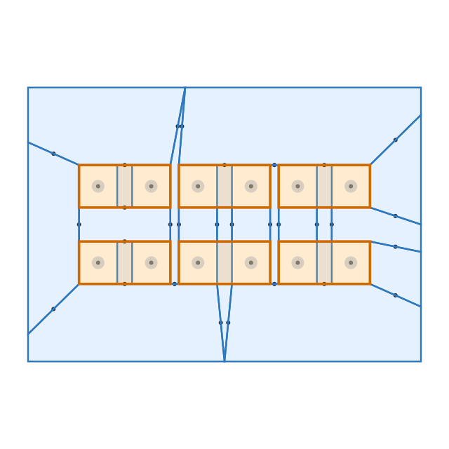
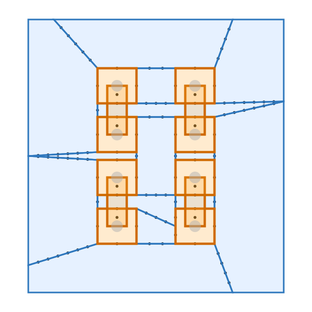
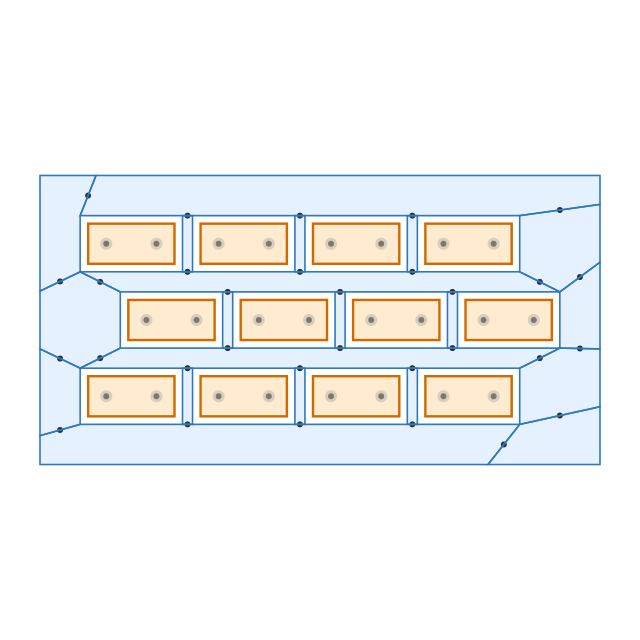
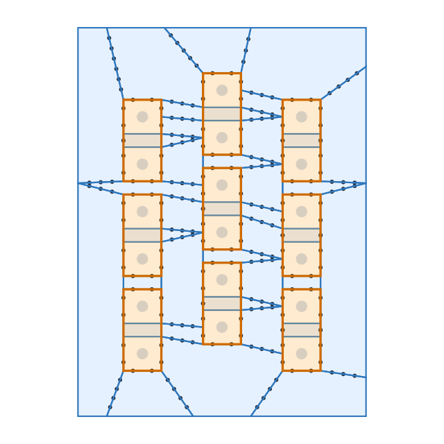
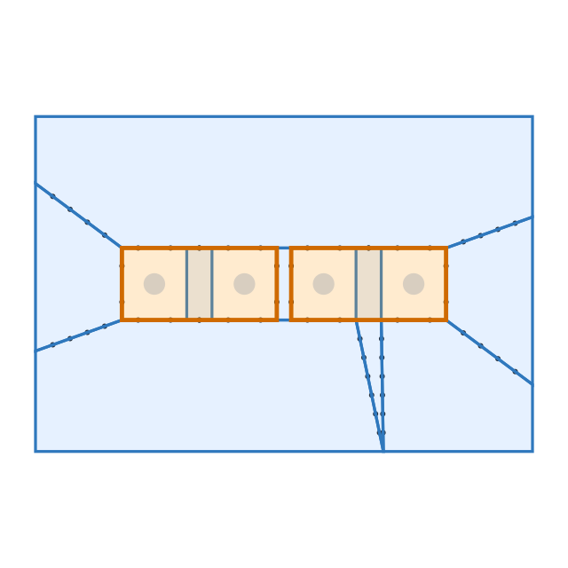

# @tscircuit/jumper-topology-generator

Generate 0603 jumper placement/topology as a HyperGraph, including:

- top-layer conductive regions
- jumper pad regions
- connectivity ports between touching regions
- via locations and overall bounds

## Preview



## Install

```bash
bun add @tscircuit/jumper-topology-generator
```

## Quick Start

```ts
import { generate0603JumperHyperGraph } from "@tscircuit/jumper-topology-generator"

const graph = generate0603JumperHyperGraph({
  cols: 3,
  rows: 2,
  orientation: "horizontal",
})

console.log(graph.regions.length)
console.log(graph.ports.length)
console.log(graph.bounds)
```

## API

### `generate0603JumperHyperGraph(options)`

Creates a `JumperHyperGraph` from a 0603 jumper matrix.

Required options:

- `cols: number` - number of jumper columns (`> 0`)
- `rows: number` - number of jumper rows (`> 0`)

Optional options:

- `pattern: "grid" | "staggered"` (default: `"grid"`)
- `orientation: "horizontal" | "vertical"` (default: `"horizontal"`)
- `pitchX: number` or `colSpacing: number` (default: `2.2`)
- `pitchY: number` or `rowSpacing: number` (default: `1.8`)
- `staggerAxis: "x" | "y"` (default: `"x"`)
- `staggerOffset: number` (or alias `staggerOffsetX`)
- `padWidth: number` (default: `0.9`)
- `padHeight: number` (default: `1.0`)
- `padGap: number` (default: `0.35`)
- `viaDiameter: number` (default: `0.3`)
- `clearance: number` (default: `0.2`)
- `concavityTolerance: number` (default: `0.3`)
- `boundsPadding: number` (default: `1.2`)
- `portSpacing: number` (default: `0.25`, must be `> 0`)
- `maxNeckRatio: number` (default: `0`, disabled when `0`; unitless neck-width ratio vs `sqrt(regionArea)`)
- `minSplitBalanceRatio: number` (default: `0.2`, must be in `[0, 0.5]`)

Behavior notes:

- `colSpacing` overrides `pitchX`; `rowSpacing` overrides `pitchY`.
- Pitch values are clamped to avoid overlap:
  - `pitchX >= jumperBodyWidth + clearance`
  - `pitchY >= jumperBodyHeight + clearance`
- For `pattern: "staggered"`, if `staggerOffset` is omitted, it defaults to half the jumper size along the stagger axis.
- Smaller `portSpacing` creates denser top-layer edge ports.
- When `maxNeckRatio > 0`, top-layer polygons are recursively split along narrow triangulation separators to eliminate chokepoints before ports are generated.

## Return Shape

`generate0603JumperHyperGraph` returns a `JumperHyperGraph` with:

- `regions`: all regions (`topLayerRegions + jumperRegions`)
- `ports`: all region-to-region connectivity ports
- `jumperLocations`: jumper-centric mapping used by `@tscircuit/hypergraph`
- `topLayerRegions`: convex top copper regions
- `jumperRegions`: one region per jumper body
- `jumpers`: raw jumper placements and pad centers
- `vias`: one via per pad center
- `bounds`: overall bounding box

## Visualization Helper

Use `visualizeJumperHyperGraph` to generate a `graphics-debug` object:

```ts
import {
  generate0603JumperHyperGraph,
  visualizeJumperHyperGraph,
} from "@tscircuit/jumper-topology-generator"

const graph = generate0603JumperHyperGraph({ cols: 2, rows: 2 })
const debugGraphics = visualizeJumperHyperGraph(graph)
```

## Examples

Staggered pattern along X:

```ts
import { generate0603JumperHyperGraph } from "@tscircuit/jumper-topology-generator"

const graph = generate0603JumperHyperGraph({
  cols: 4,
  rows: 3,
  pattern: "staggered",
  staggerAxis: "x",
  orientation: "horizontal",
})
```

Vertical jumpers with coarser edge ports:

```ts
import { generate0603JumperHyperGraph } from "@tscircuit/jumper-topology-generator"

const graph = generate0603JumperHyperGraph({
  cols: 2,
  rows: 2,
  orientation: "vertical",
  portSpacing: 0.75,
})
```

## Output Previews

Horizontal grid (`cols: 3, rows: 2, orientation: "horizontal"`):


Vertical grid (`cols: 2, rows: 2, orientation: "vertical"`):



Staggered X (`cols: 4, rows: 3, pattern: "staggered", staggerAxis: "x"`):



Staggered Y (`cols: 3, rows: 3, pattern: "staggered", staggerAxis: "y"`):



SVG export fixture (`cols: 2, rows: 1`):



## Local Development

Install dependencies:

```bash
bun install
```

Build:

```bash
bun run build
```

Explore fixtures in React Cosmos:

```bash
bun run start
```
